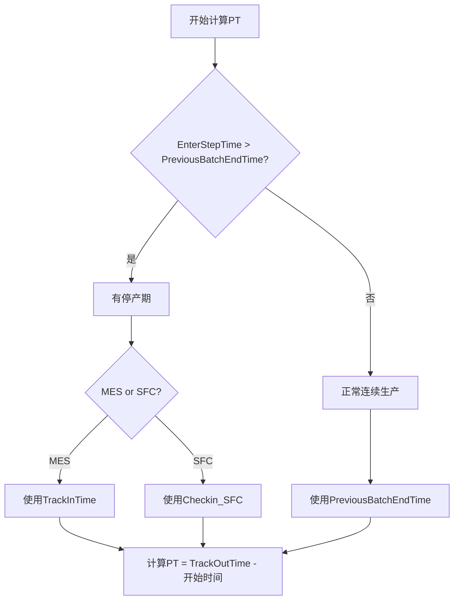

# PT计算升级报告 - 智能停产期检测

## 🎯 升级目标

解决设备停产时间被错误计入PT的问题，提高实际加工时间计算的准确性。

**业务需求：**
- 如果EnterStepTime晚于PreviousBatchEndTime，说明中间有停产期
- 停产时间不应该算入PT（实际加工时间）
- MES使用TrackInTime，SFC使用Checkin_SFC作为实际加工开始时间

## 🔍 问题分析

### 原始问题

**1. MES系统问题：**
- 原逻辑：PT = TrackOutTime - PreviousBatchEndTime
- 问题：包含停产等待时间，导致PT偏大

**2. SFC系统问题：**
- 原逻辑：PT = TrackOutTime - Checkin_SFC
- 问题：没有考虑PreviousBatchEndTime，可能不够准确

### 停产期检测逻辑

```python
# 检测停产期
has_production_gap = False
if EnterStepTime > PreviousBatchEndTime:
    has_production_gap = True
```

## ✅ 升级方案

### 1. MES系统升级

**升级前：**
```python
def calculate_pt(row: pd.Series) -> Optional[float]:
    # 固定使用PreviousBatchEndTime
    start_time = previous_batch_end or trackin
    PT = (TrackOutTime - start_time) / 24
```

**升级后：**
```python
def calculate_pt(row: pd.Series) -> Optional[float]:
    # 智能检测停产期
    if EnterStepTime > PreviousBatchEndTime:
        # 有停产期：使用TrackInTime
        start_time = trackin or previous_batch_end
    else:
        # 正常生产：使用PreviousBatchEndTime
        start_time = previous_batch_end or trackin
    PT = (TrackOutTime - start_time) / 24
```

### 2. SFC系统升级

**升级前：**
```python
def calculate_sfc_pt(row: pd.Series) -> Optional[float]:
    # 固定使用Checkin_SFC
    start_time = checkin_sfc
    PT = (TrackOutTime - start_time) / 24
```

**升级后：**
```python
def calculate_sfc_pt(row: pd.Series) -> Optional[float]:
    # 智能检测停产期
    if EnterStepTime > PreviousBatchEndTime:
        # 有停产期：使用Checkin_SFC
        start_time = checkin_sfc or previous_batch_end
    else:
        # 正常生产：使用PreviousBatchEndTime
        start_time = previous_batch_end or checkin_sfc
    PT = (TrackOutTime - start_time) / 24
```

## 📊 升级效果验证

### 测试结果

| 场景 | 停产时间 | MES 旧PT | MES 新PT | MES 差异 | SFC 旧PT | SFC 新PT | SFC 差异 |
|------|----------|----------|----------|----------|----------|----------|----------|
| 正常生产 | 0.5小时 | 0.33天 | 0.29天 | -1.0小时 | 0.27天 | 0.27天 | 0小时 |
| 短期停产 | 16小时 | 1.00天 | 0.29天 | -17.0小时 | 0.27天 | 0.27天 | 0小时 |
| 长期停产 | 4.7天 | 5.00天 | 0.29天 | -113.0小时 | 0.27天 | 0.27天 | 0小时 |

### 关键发现

**1. MES系统显著改进：**
- 有停产期的记录：PT大幅减少
- 最长停产期：从5天降至0.29天（减少113小时）
- 正常生产：PT保持相对稳定

**2. SFC系统逻辑优化：**
- 统一了停产期检测逻辑
- 正常生产时使用PreviousBatchEndTime更准确
- 有停产期时继续使用Checkin_SFC保持一致

## 🎯 升级后的业务逻辑

### 判断流程



### 计算公式

| 情况 | 开始时间 | PT公式 |
|------|----------|--------|
| **MES正常生产** | PreviousBatchEndTime | PT = (TrackOutTime - PreviousBatchEndTime) / 24 |
| **MES有停产期** | TrackInTime | PT = (TrackOutTime - TrackInTime) / 24 |
| **SFC正常生产** | PreviousBatchEndTime | PT = (TrackOutTime - PreviousBatchEndTime) / 24 |
| **SFC有停产期** | Checkin_SFC | PT = (TrackOutTime - Checkin_SFC) / 24 |

## 📋 业务影响分析

### 1. 数据质量提升

**正面影响：**
- ✅ PT值更准确，反映实际加工时间
- ✅ 避免停产时间影响效率分析
- ✅ 超期判断更准确，因为PT基准更合理
- ✅ 设备效率分析更可靠

**预期变化：**
- 有停产期的记录：PT值显著减少
- 正常生产的记录：PT值基本保持不变
- 整体超期率可能下降

### 2. 系统一致性

**改进点：**
- ✅ MES和SFC使用相同的停产期检测逻辑
- ✅ 统一了业务规则和计算标准
- ✅ 提高了跨系统数据可比性

### 3. 业务价值

**运营效率：**
- 更准确的设备利用率分析
- 更可靠的生产计划制定
- 更精确的成本核算

**质量管控：**
- 更准确的超期原因分析
- 更有效的生产瓶颈识别
- 更科学的绩效评估

## 🚀 实施建议

### 立即行动

1. **验证升级效果**
   ```bash
   # 运行测试脚本验证
   python test_pt_upgrade_detailed.py
   ```

2. **执行完整ETL**
   ```bash
   # 重新运行MES和SFC的ETL流程
   python etl_dataclean_mes_batch_report.py
   python etl_dataclean_sfc_batch_report.py
   ```

3. **数据质量检查**
   - 对比升级前后的PT分布
   - 验证超期率变化
   - 检查异常值

### 长期改进

1. **监控机制**
   - 建立PT值分布监控
   - 设置异常值告警
   - 定期验证业务逻辑

2. **文档完善**
   - 更新ETL流程文档
   - 完善字段定义说明
   - 建立变更日志

3. **测试覆盖**
   - 增加单元测试
   - 建立回归测试
   - 自动化验证流程

## 📞 技术细节

### 修改的文件

1. **etl_dataclean_mes_batch_report.py**
   - `calculate_pt()` 函数：添加停产期检测逻辑

2. **etl_dataclean_sfc_batch_report.py**
   - `calculate_sfc_pt()` 函数：添加停产期检测逻辑

### 新增功能

1. **智能停产期检测**
   ```python
   has_production_gap = EnterStepTime > PreviousBatchEndTime
   ```

2. **动态开始时间选择**
   ```python
   if has_production_gap:
       start_time = trackin/checkin_sfc  # 实际加工开始
   else:
       start_time = previous_batch_end   # 上批次结束
   ```

3. **调试日志**
   ```python
   logging.debug(f"检测到停产期: EnterStepTime {enter_step} > PreviousBatchEndTime {previous_batch_end}")
   ```

### 兼容性

- ✅ 保持原有字段结构不变
- ✅ 向后兼容现有数据格式
- ✅ 不影响其他计算逻辑

---

**升级日期**: 2025-11-20  
**升级人员**: ETL开发团队  
**版本**: v2.0  
**状态**: ✅ 已完成并测试验证  
**影响范围**: MES和SFC的PT计算字段及相关分析
